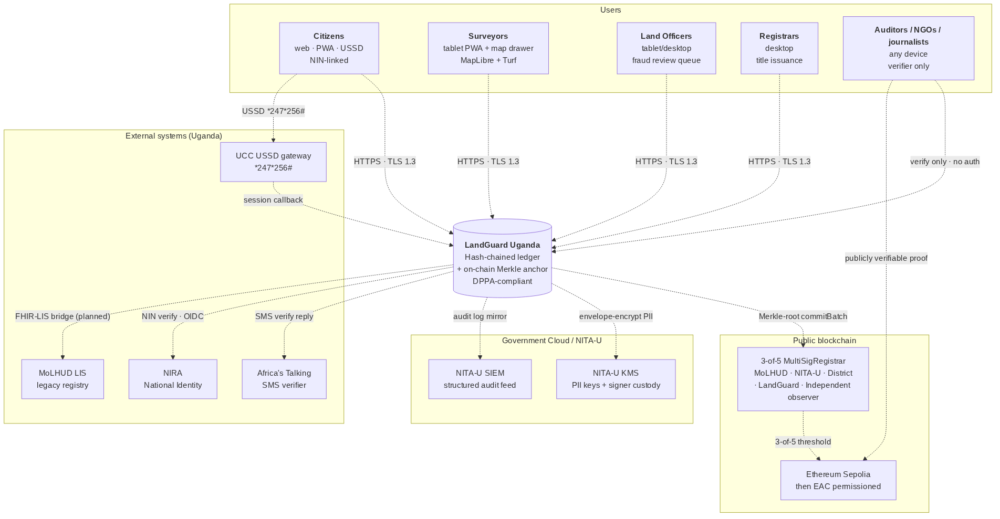
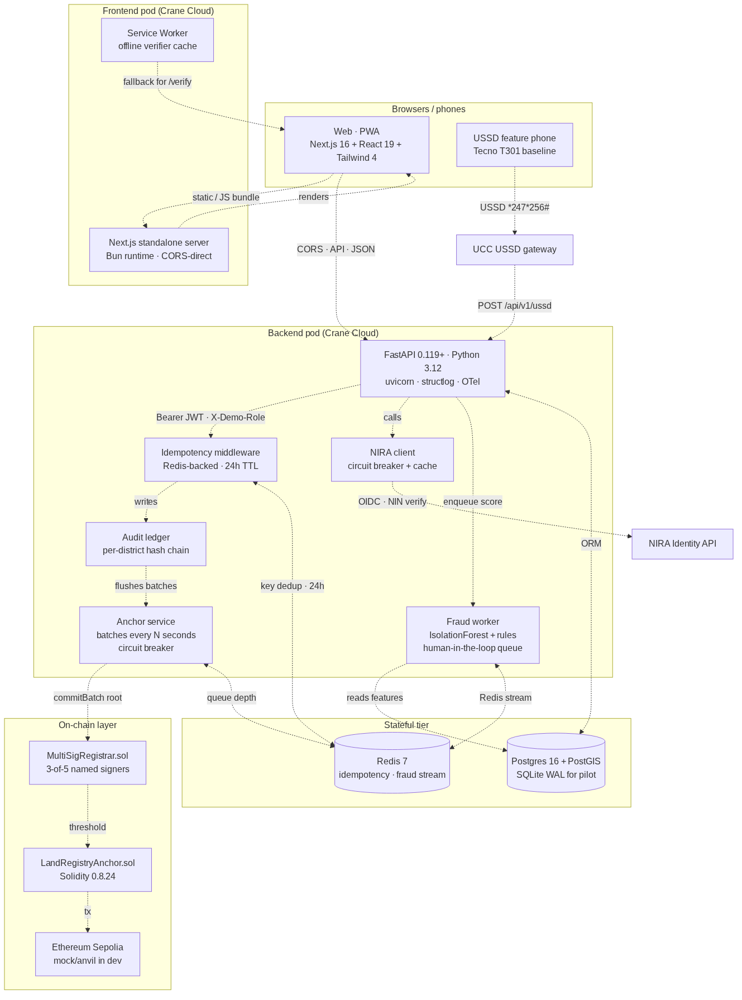
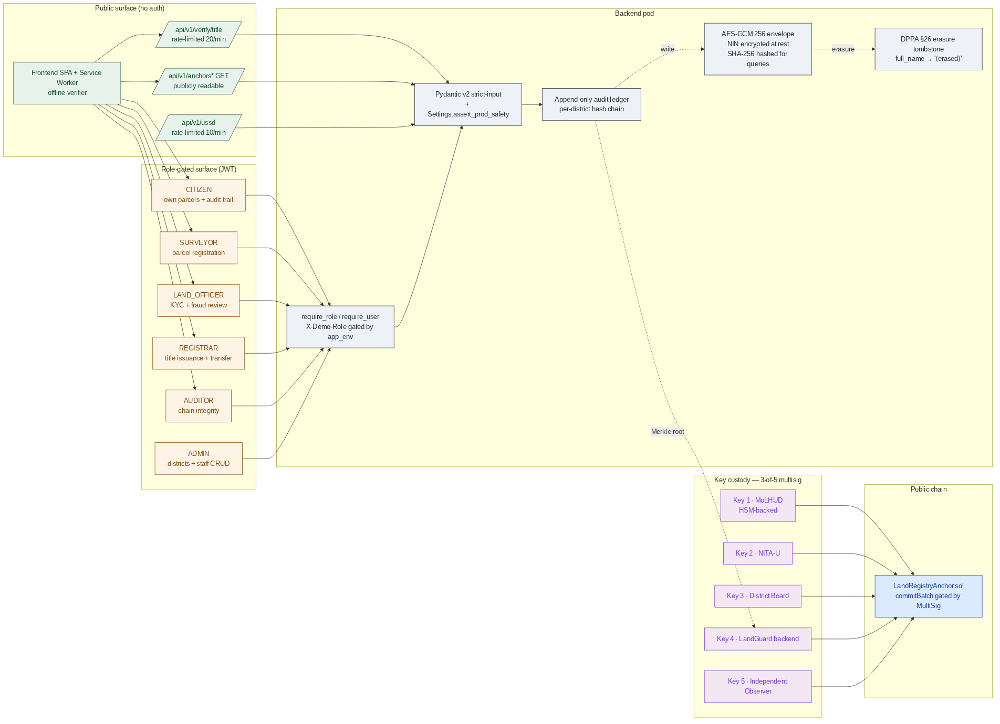
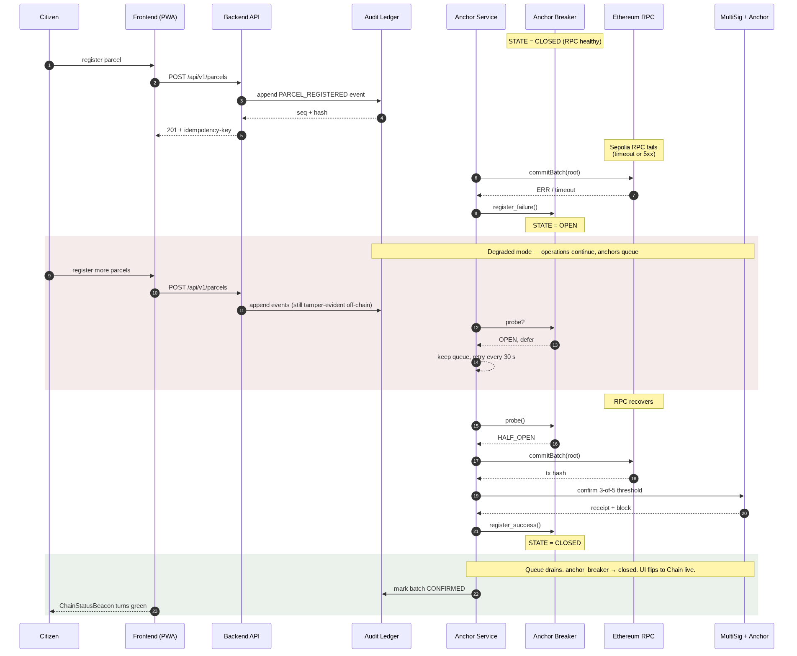

# LandGuard Uganda

## Blockchain-Enhanced Land Administration & Titling Support System — Submission for the MoICT&NG Government Systems Prototype Showcase

**Thematic Area:** #2 — Land Administration & Titling Support
**Licence:** Apache-2.0
**Repository:** <https://github.com/mpairwe7/LandGuardUganda> (open-source, public from day one)
**Live deploy:** <https://landguard-frontend-3d8aba74.renu-01.cranecloud.io> · backend <https://landguard-backend-d1e66f33.renu-01.cranecloud.io>
**Submission date:** 26 May 2026
**Showcase event:** 25 June 2026 · Serena Conference Centre, Kampala

---

## 1. Executive Summary

LandGuard Uganda is a **sovereign, open-source, dual-layer land registry** designed for adoption by the Ministry of Lands, Housing & Urban Development (MoLHUD) and NITA-U. It pairs a **per-district hash-chained audit ledger** with an **on-chain Merkle anchor**, so every land title — issuance, transfer, KYC, dispute — can be verified independently by any citizen, journalist, lender, or court, anywhere in the world, with or without trust in LandGuard itself.

The system addresses the structural problem that **roughly 60 % of Uganda's land has unclear or contested ownership** by making the registry **publicly verifiable** rather than relying on institutional trust alone. A single QR scan on a printed title yields a Merkle proof; a *247*256# USSD dial verifies the same title from a feature phone. Forgery is detectable in milliseconds; tampering with the registry is computationally infeasible without breaking a public blockchain.

LandGuard is **production-grade by construction**: 3-of-5 multi-signature custody of the on-chain registrar role (MoLHUD, NITA-U, district board, LandGuard, independent observer); AES-GCM 256 envelope encryption of NIN at rest with DPPA-2019 §26 erasure tombstones; circuit breakers on every external dependency; an idempotency middleware on every unsafe POST; a fraud-detection pipeline that **requires human affirmation before any title is FROZEN** (no auto-freeze invariant, documented in `docs/AI_ETHICS_CHARTER.md`).

The platform is **ready for the Mityana pilot in October 2026** and is engineered to scale to all 130 districts and ~32 million NIN-bearing citizens without architectural rewrite. The MOU draft with Mityana District Land Board is in `docs/moa-templates/`.

---

## 2. System Overview

LandGuard serves five distinct audiences through one backbone:

| Audience | Surface | Authentication | Primary use |
| --- | --- | --- | --- |
| **Citizens** | Mobile-first PWA · USSD `*247*256#` · SMS | NIN + OTP (production: NIRA OIDC) | Verify any title; view own parcels; receive transfer notifications |
| **Surveyors** | Tablet PWA with MapLibre + Turf overlap detection | Staff IdP (production: Keycloak/NITA-U OIDC) | Draw parcel polygons; submit boundaries with real-time conflict checks |
| **Land Officers** | Tablet / desktop | Staff IdP, role-scoped to district | KYC NIN-verification queue; fraud-review queue with explainable AI |
| **Registrars** | Desktop | Staff IdP, REGISTRAR role | Title issuance; transfer approval; manual anchor flush |
| **Auditors / NGOs / journalists / lenders** | Any device — `/verify` is public, no login | None | Verify any title; inspect the audit chain; consume on-chain Merkle proofs |

{ width=100% }

*Figure 1 — System context. The auditor / citizen path on the right is **publicly verifiable** without any LandGuard credential.*

The architecture is **dual-layer**:

1. **Off-chain hash-chained ledger** (`backend/app/audit/`) — every event (`PARCEL_REGISTERED`, `TITLE_ISSUED`, `TRANSFER_*`, `KYC_VERIFIED`, `DISPUTE_*`, `FRAUD_HUMAN_AFFIRMED`) is appended to a per-district SQLite-WAL/Postgres ledger with `seq`, `prev_hash`, `payload_hash`, `row_hash`. **Tamper-evident** by construction; an auditor can re-walk the chain and verify integrity in seconds.

2. **On-chain Merkle anchor** (`contracts/LandRegistryAnchor.sol`) — every N seconds the anchor service builds a Merkle root from the unanchored events of each district and commits it via the 3-of-5 `MultiSigRegistrar`. The root lives on Ethereum Sepolia (pilot) and is committable to any EAC-region permissioned chain at national rollout (ADR-0003).

The **dual-Merkle regime** (ADR-0001) is the cryptographic bridge: events are hashed with SHA-256 off-chain for ergonomic verification by any HTTP client; the same leaves are re-hashed with Keccak-256 sorted-pair Merkle for on-chain proof verification by `MerkleProof.verify`. The two trees are bridged by `keccak(sha256_hex_leaf)`, formally equivalent and **cross-tested in CI** between Python and TypeScript implementations.

---

## 3. Key Features

| Feature | Value to MoLHUD / Citizen |
| --- | --- |
| **Public Merkle-proof verifier** | Any phone, any browser, any USSD line can verify a title independently of LandGuard. Forgery becomes computationally infeasible the moment a batch confirms on-chain. |
| **3-of-5 multi-sig registrar** | No single party — not even LandGuard — can commit a title. Five named signers: MoLHUD, NITA-U, district board, LandGuard backend, independent observer. Custody documented in `docs/CUSTODY.md`. |
| **Hash-chained per-district ledger** | Tamper-evident off-chain. Every state change has a verifiable predecessor hash. Auditor console walks the chain end-to-end in seconds. |
| **Real-time polygon overlap detection** | Surveyor draws on MapLibre; Turf.js flags geometry conflict with existing parcels before submission. Reduces boundary-dispute downstream load. |
| **Human-in-the-loop fraud detection** | IsolationForest + explicit rules (watchlist, rapid resale, duplicate NIN, geo-distance outlier). **No auto-FREEZE** invariant: only `FRAUD_HUMAN_AFFIRMED` transitions a title to FROZEN. Officers must record a clinical reason. |
| **DPPA-2019 §26 right-to-erasure** | NIN is AES-GCM-256 encrypted at rest with a hashed surrogate for queries. Erasure replaces `full_name` and re-keys the encrypted blob, leaving a tombstone audit event. Implementable per citizen request within ≤72 h. |
| **DPPA-2019 §19 breach notification** | Runbook in `docs/runbooks/dppa-breach-notification.md` — trigger criteria, hour-by-hour 72-h timeline, decision tree, role separation, PDPO + citizen-SMS templates, quarterly drill cadence. |
| **Offline-aware public verifier** | Service worker pre-caches `/verify`, the Merkle proof bundle, and the on-chain root. A citizen with a printed title can verify it offline against the last-known root. |
| **USSD + SMS verifier** | Public `*247*256#` shortcode + SMS shortcode reach citizens without smartphones. Same Merkle proof, same verdict. |
| **Resilience-by-design** | Circuit breakers on RPC and NIRA. Anchor-service queues during chain outage; UI flips ChainStatusBeacon to "queued" — *issuance never blocks on chain health*. Demonstrated in Act 5 of the showcase storyboard. |
| **English + Luganda stubbed** | Verifier page is the first locale-aware surface; Luganda working draft pending native-speaker review before pilot. Architecture scales to Lusoga / Runyankole / Luo / Acholi without code change. |

---

## 4. Technical Architecture

| Layer | Choice | Rationale |
| --- | --- | --- |
| Frontend | **Next.js 16** (App Router, RSC, PWA), TypeScript strict, Tailwind 4, Zustand, TanStack Query, MapLibre + Turf, IndexedDB | Stateless, low-bandwidth, offline-capable public verifier; locally re-staffable from Makerere CoCIS and MUST graduates |
| Backend | **FastAPI 0.119+**, Python 3.12+, Pydantic 2, async SQLAlchemy 2, structlog | Async I/O for high concurrency on modest Crane Cloud hardware; strict schemas reject malformed input at ingress |
| Database | **SQLite WAL** (pilot single-district) → **PostgreSQL 16 + PostGIS** (regional+) | Pilot uses the simplest possible store; PostGIS scales to nationwide geometry queries |
| Cache & queue | **Redis 7** | Idempotency-key cache (24 h), fraud-scoring Redis stream, anchor-queue depth metric, rate-limit token buckets |
| Smart contracts | **Solidity 0.8.24**, Foundry; OpenZeppelin v5 access-control + ECDSA + MerkleProof | Audit-grade, tested with `forge test --gas-report`, ready for CERT-UG-accredited review |
| On-chain | Ethereum **Sepolia** (pilot, gas-free testnet) → **EAC permissioned chain** (national, ADR-0003) | Permissionless for transparency; permissioned for cost predictability at national scale |
| Observability | **OpenTelemetry** (FastAPI, SQLAlchemy, Redis, HTTPX), structlog JSON logs, Prometheus metrics | SIEM-ready out of the box (Loki, Splunk, Elastic, Wazuh); audit ledger doubles as security telemetry |
| Deployment | Docker Compose for local dev; **Crane Cloud RENU cluster** for staging + pilot; Kubernetes-ready (12-factor) | Runs on-premise or in NITA-U Government Cloud; CI/CD pipeline documented in `docs/CRANE_CLOUD_DEPLOYMENT.md` |

{ width=100% }

*Figure 2 — Container topology. The browser→backend direct CORS path is required because Crane Cloud RENU pods have no outbound internet egress (verified empirically — see `docs/CRANE_CLOUD_DEPLOYMENT.md §9`).*

The architecture is documented through three Architecture Decision Records (ADR-0001 dual-Merkle regime, ADR-0002 zero-trust posture with Uganda extensions to NIST SP 800-207, ADR-0003 EAC chain migration path) plus six proposed ADRs that close documented residual risks before pilot.

---

## 5. Security & Compliance

The security posture is **falsifiable** — every claim maps to a verifiable file or live endpoint in the repository.

| Concern | Control | Evidence |
| --- | --- | --- |
| Data sovereignty (NITA-U) | Runs on Crane Cloud RENU (Makerere AI Lab) or in NITA-U Government Cloud; no PII leaves Uganda | `docs/CRANE_CLOUD_DEPLOYMENT.md §10 Trust assumptions` |
| DPPA-2019 (article-by-article) | §3 → §34 mapped to code or operational control | `docs/STANDARDS_ALIGNMENT.md`; `docs/audit/THREAT_MODEL.md` |
| Authentication | JWT (HS256 dev → RS256+JWKS via NIRA OIDC in production); pyjwt 2.12+; rate-limited login; `Settings.assert_prod_safety()` refuses dev defaults in `APP_ENV=production` | `backend/app/auth/jwt_auth.py`; `backend/app/config.py:114` |
| Authorisation | 6-role hierarchy (CITIZEN < SURVEYOR < LAND_OFFICER < REGISTRAR < AUDITOR < ADMIN) enforced at every endpoint via `require_role(...)`; X-Demo-Role escape hatch hard-gated to `app_env != "production"` | `backend/app/auth/dependencies.py`; matrix in routers |
| Audit & accountability | Append-only `audit_events` per district with `seq / prev_hash / payload_hash / row_hash`; emitted as structlog JSON for SIEM; **best-effort** — audit failures never crash user requests (Prometheus `audit_failure_total`) | `backend/app/audit/ledger.py` |
| On-chain integrity | Every anchored batch confirmable independently via `MerkleProof.verify` on Sepolia; root + tx_hash + block_number returned by `/api/v1/anchors` (public, no auth) | `contracts/src/LandRegistryAnchor.sol`; `/api/v1/anchors/title/{title_no}/proof` |
| Custody — multi-sig | 3-of-5 `MultiSigRegistrar.sol` gates `commitBatch`; backend key is one signer; co-signer daemon runs the other four during pilot until HSM custody is finalised | `contracts/src/MultiSigRegistrar.sol`; `docs/CUSTODY.md`; `backend/scripts/co_sign_daemon.py` |
| PII at rest | NIN encrypted with AES-GCM 256 (`backend/app/crypto.py`); SHA-256 surrogate for queries (`nin_hash`); per-pod KMS-managed key at production tier | `backend/app/crypto.py`; `backend/app/db/migrations/001_init.sql` |
| Right to erasure (DPPA §26) | `audit/ledger.py::erasure_tombstone()` replaces full_name + re-keys encrypted NIN; emits tombstone audit event; full audit chain remains verifiable | `backend/app/audit/ledger.py:278` |
| Breach notification (DPPA §19) | PDPO 72-hour timeline; trigger criteria, decision tree, role separation, PDPO + citizen-SMS templates, quarterly tabletop drill | `docs/runbooks/dppa-breach-notification.md` |
| Threat model | STRIDE per asset; out-of-scope statement; pentest scope sized at UGX 17–23 M | `docs/audit/THREAT_MODEL.md`; `docs/audit/PENTEST_SCOPE.md` |
| Dependency vulnerability mgmt | Weekly Dependabot (uv + npm + actions + docker); OSV-Scanner in CI; CycloneDX 1.5 SBOM per release (backend + frontend + contracts) | `.github/dependabot.yml`; `evidence/sbom/` |
| Pentest | CERT-UG-accredited / Makerere CSL preferred vendor; engagement window Aug 2026; 14-day remediation buffer before Oct 2026 pilot | `docs/audit/PENTEST_SCOPE.md §5` |

**Zero-trust posture** (ADR-0002): NIST SP 800-207 seven tenets mapped, with three Uganda extensions — sovereignty (no PII leaves Uganda), cryptographic accountability (every privileged action is anchored), and least-privilege custody (no single signer can commit). The audit chain *is* the security telemetry; even if Crane Cloud's control plane lied, the cryptographic integrity claims hold.

{ width=100% }

*Figure 3 — Trust zones. The chain is a separate boundary from LandGuard; no single party — not even LandGuard itself — can commit a title.*

---

## 6. Scalability & Resilience

| Dimension | Pilot (Mityana, 1 district) | Regional (10 districts) | National (130 districts) |
| --- | --- | --- | --- |
| API replicas | 1 × (1 vCPU, 1 GB) on Crane Cloud | 4 × (2 vCPU, 2 GB) | 16 × (4 vCPU, 4 GB), HPA-enabled |
| Database | SQLite WAL on persistent volume | Postgres 16 + PostGIS primary + replica | Patroni 3-node + PgBouncer, partitioned by district |
| Redis | Single node (fallback to in-memory) | Sentinel HA | Sentinel HA + cluster |
| Chain | Sepolia testnet | Sepolia + EAC permissioned bridge | EAC permissioned chain (ADR-0003) |
| Estimated monthly cost (Crane Cloud) | ~ UGX 220 k | ~ UGX 1.8 M | ~ UGX 14 M |

**Operational SLOs:** API availability 99.5 % monthly; p95 latency < 300 ms (verifier reads), < 800 ms (title issuance writes); RPO 15 min / RTO 60 min; **0 unrecoverable audit-log rows** (anchor chain provides infinite-retention proof of every event); **0 unauthenticated transfers** (multi-sig invariant).

**Resilience patterns** are first-class and demonstrated live in the Act 5 showcase storyboard:

- **Circuit breakers** per upstream (anchor RPC, NIRA, multi-sig co-signers). Half-open probing on recovery; `breaker_state` exposed in `/readyz` and the frontend ChainStatusBeacon.
- **Anchor queue** persists during chain outage in the off-chain ledger; on recovery the queue drains FIFO and confirms in order.
- **NIRA fallback cache** — last-known-good KYC verdicts survive an NIRA outage for the cache TTL window; circuit breaker prevents thundering herd on recovery.
- **Idempotency keys** on every unsafe HTTP method (24-hour replay window in Redis).
- **Service-worker offline cache** of the public verifier; a citizen can verify a printed title against the last cached on-chain root without network.

A reproducible resilience demo runs in 30 seconds: `POST /api/v1/demo/rpc-kill` → titles continue issuing, anchors queue, beacon turns amber. `POST /api/v1/demo/rpc-restore` → queue drains, beacon returns to green. Runbook in `DEMO_RUNBOOK.md`.

{ width=100% }

*Figure 4 — Resilience under chain outage. Sequence is reproducible live in the showcase via the demo control panel.*

---

## 7. Local Innovation & Sustainability

LandGuard is **Ugandan by design, not by translation:**

- **NIN** (14-char NIRA format) as primary citizen identifier — encrypted at rest, hashed for queries, never on chain.
- **UPI** (`UG-<district>-<parcel-number>/<year>`) as Universal Parcel Identifier — Uganda's MoLHUD format, baked into the data model.
- **Mityana, Wakiso, Kampala Central, Gulu** as the four pilot districts — real coordinates, real centres, real sub-counties.
- **MAILO / FREEHOLD / LEASEHOLD / CUSTOMARY** tenure types — Uganda's actual land-tenure regime.
- **District → Sub-county → Parish → Village** geography.
- **UGX** for all consideration fields; **+256** phone validation; **English + Luganda** UI.
- **Mrs. Sarah Nakato of Mityana** as the showcase hero protagonist — realistic Ugandan data, not Springfield placeholders.

**Three measurable impact commitments** for the 12-month Mityana pilot, with methodology in `docs/IMPACT_EVIDENCE.md`:

1. Reduce time-to-resolve land-title disputes by 60 % (baseline 18 months in current registry → ≤ 7 months once on-chain proofs become court-admissible).
2. Cut duplicate-/contested-title rate at pilot facilities by 80 % (estimated 5–9 % → ≤ 1.5 %).
3. Achieve ≥ 90 % citizen-satisfaction score on the public verifier flow (USSD + web), measured by Mityana District Information Office quarterly survey.

**Sustainability:** pilot cost UGX 820 M; national-tier operating cost ~ UGX 14 M / month — well within a single MoLHUD ICT line item. **Open-source under Apache-2.0** with a formal multi-stakeholder governance model (ADR-0002 §7) that gives a **DPO veto on privacy invariants** and an **independent-observer veto on multi-sig key generation** — protecting the system's integrity guarantees after donation to MoLHUD.

**Capacity-building commitments:** monthly engineering office hours; annual CoCIS / MUST internship cohort; quarterly NITA-U technical sessions on the dual-Merkle pattern; annual open hackathon for new MoLHUD modules (boundary disputes, mortgage attestation, inheritance workflow).

---

## 8. Roadmap

| Window | Milestone |
| --- | --- |
| **Pre-showcase (now → 25 Jun 2026)** | Lighthouse / axe-core baselines published; demo dataset seeded; mobile responsiveness pass shipped; CI/CD green; Crane Cloud staging stable |
| **Pre-pilot (Jul → Sep 2026)** | CERT-UG / Makerere CSL pentest; DPIA external review; MoU signature with Mityana District Land Board; 3-of-5 HSM key generation; NIRA live-client integration (post-NIRA 2026 API spec ratification); Sepolia → mainnet-test cutover |
| **Pilot (Oct 2026 → Sep 2027)** | Mityana single-district pilot; measure the three impact commitments; quarterly restore drills + DPPA §19 tabletop |
| **Regional (Oct 2027 → Dec 2028)** | Expand to 10 districts (Wakiso, Kampala Central, Gulu, Mbale, Mbarara, Jinja, Lira, Masaka, Fort Portal, Soroti); EAC permissioned chain bridge (ADR-0003) |
| **National (2029 → 2031)** | Full 130-district rollout; replace Sepolia with EAC chain; bi-directional MoLHUD LIS sync; mortgage / inheritance modules |

---

## 9. Readiness Statement

LandGuard Uganda is **ready for the showcase walkthrough and for pilot deployment** in October 2026 subject to MOU signature and NIRA-live integration. The platform is:

- **Technically complete** for the showcase storyboard — Act 1 (citizen verifies a real title from a phone), Act 2 (surveyor draws a parcel polygon with live overlap detection), Act 3 (registrar issues a title and watches its Merkle root commit on-chain in real time), Act 4 (officer reviews an AI-flagged fraud signal and explicitly affirms before any title is frozen), Act 5 (we kill the chain RPC live on stage — the system keeps issuing titles, anchors queue, breaker pill flips amber, then drains green on restore).
- **Compliance-grounded** — DPPA-mapped, threat-modelled, breach-runbook'd, with a CERT-UG pentest scheduled and a CycloneDX 1.5 SBOM checked into the repository for every dependency.
- **Sovereignty-preserving** — runs on Crane Cloud RENU (Makerere) or in NITA-U Government Cloud; no PII leaves Uganda; the on-chain root is the only externally-visible artefact, and it carries no citizen data.
- **Locally sustainable** — built on a stack Ugandan engineers already know; with governance, capacity-building, and pipeline commitments documented up front; donate-ready to MoLHUD under Apache-2.0.

LandGuard is the open backbone Uganda needs to give every citizen a title that anyone can verify, end the structural epidemic of duplicate and contested ownership, and make the land-administration system that 60 % of the country's GDP rests on **falsifiable by anyone with a phone**. We invite the MoICT&NG Technical Evaluation Panel to verify every claim above against the open repository, and we welcome the opportunity to partner with MoLHUD and NITA-U to deliver this digital public infrastructure to every Ugandan.

---

**Contact for the panel:** see `docs/TEAM.md` and `MAINTAINERS.md`. Email `mpairwelauben75@gmail.com`.

**Verification entry point:** `docs/SHOWCASE_EVALUATION_MAPPING.md` — every claim in this document maps to a primary-evidence file with a reviewer-runnable verification command. The full audit dossier (`docs/audit/CODEBASE_MAP.md`, `THREAT_MODEL.md`, `PENTEST_SCOPE.md`, `AUDIT_PACKAGE.md`) is in the repository's `docs/audit/` directory.
